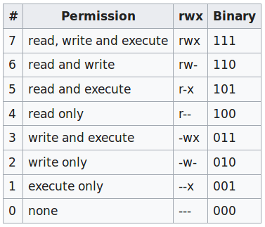
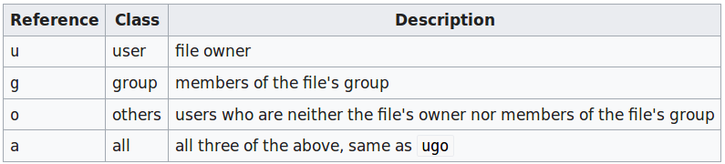
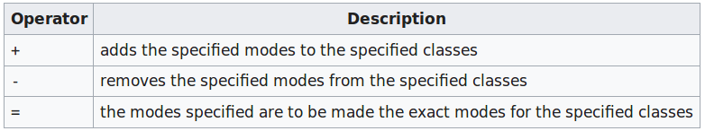
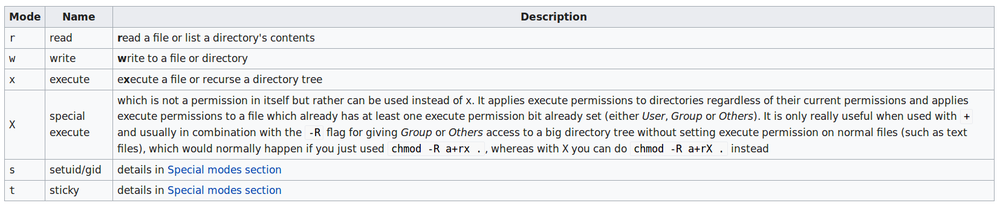

# 文件权限

## 2级访问控制

`Linux`使用`2`级权限方式控制文件的访问:

* 第一级是针对读/写/执行的权限设置；
* 第二级是针对用户/组/其他的权限设置

### 读/写/执行

* 读权限控制文件内容是否可以被读取，以`r`表示
* 写权限控制文件内容是否可以被修改，以`w`表示
* 执行权限控制文件是否可以被执行，以`x`表示

### 用户/组/其他

`Linux`针对当前文件将用户划分为`3`个范围：

* 拥有该文件的用户
* 和当前用户属于同一组的其他用户
* 不和当前用户属于同一组的其他用户

## 查询工具

通常使用以下几种工具查询文件权限

* `ls`
* `stat`

### ls

`ls`是最常用的文件信息查询工具

>List information about the FILEs (the current directory by default).

#### 单个文件

```
$ ls -al Dockerfile 
-rw-rw-r-- 1 zj zj 119 9月  24 16:03 Dockerfile
```

#### 多个文件

搜索当前目录的所有文件权限

```
$ ls -al
total 68
drwxrwxr-x  10 zj zj  4096 9月  28 09:53 .
drwxr-xr-x  74 zj zj  4096 9月  29 09:25 ..
drwxrwxr-x  17 zj zj  4096 9月  25 16:20 deepin-wine-ubuntu
-rw-rw-r--   1 zj zj   119 9月  24 16:03 Dockerfile
drwxrwxr-x 201 zj zj  4096 9月  24 11:22 dockerfiles
...
...
```

#### 说明

以单个文件搜索结果为例，文件权限部分在第一列

```
-rw-rw-r--
```

第一字节表示节点类型（`node type`）：`-`表示文件；`d`表示目录；`l`表示符号链接；`c`表示字符设备；`p`表示伪终端；`b`表示块设备

接下来`9`个字符分为`3`块，分别代表用户、组和其他的权限；每块`3`个字符，分别代表读、写和执行权限

`r`表示读；`w`表示写；`x`表示执行；`-`表示没有权限

所以文件`Dockerfile`可以被当前用户读/写，被同组用户读/写，被其他用户读

### stat

`stat`是一个更详细的文件权限查询工具

```
$ stat Dockerfile 
  File: 'Dockerfile'
  Size: 119       	Blocks: 8          IO Block: 4096   regular file
Device: 10304h/66308d	Inode: 17118015    Links: 1
Access: (0664/-rw-rw-r--)  Uid: ( 1000/      zj)   Gid: ( 1000/      zj)
Access: 2019-09-26 15:38:17.136309351 +0800
Modify: 2019-09-24 16:03:31.089612824 +0800
Change: 2019-09-24 16:03:31.121613208 +0800
 Birth: -
```

#### 打印访问权限

```
$ stat -c %A Dockerfile 
-rw-r--r--
$ stat -c %a Dockerfile 
644
```

#### 打印所属用户/组

```
# 组合打印文件所属用户/组
$ stat -c %U:%G dockerfiles/ 
zj:zj
```

#### 打印文件类型

```
# 文件
$ stat -c %F Dockerfile 
regular file
# 目录
$ stat -c %F dockerfiles/ 
directory
```

## 设置工具

针对`Linux`的`2`级访问控制，使用`chmod`修改文件的读/写/执行权限，使用`chown/chgrp`修改文件的用户/组/其他权限

### chmod

使用[chmod](https://en.wikipedia.org/wiki/Chmod)进行设置，有两种方式设置文件权限

1. 数值设置
2. 符号设置

*参数`-v`表示显示文件权限的改变信息*

*参数`-R, --recursive`表示递归设置文件权限*

#### 数值设置

语法如下：

```
chmod [OPTION]... OCTAL-MODE FILE...
```

`chmod`以`8`进制数值表示文件的权限，通过数值设置可以准确修改用户/组/其他的文件权限



以`754`为例，其表示如下

* 对于当前用户而言，其对文件能够*读/写/执行*
* 对于同组用户而言，其对文件能够*读/执行*
* 对于其他用户而言，其对文件能够*读*

执行如下：

```
$ chmod -v 754 Dockerfile 
mode of 'Dockerfile' changed from 0775 (rwxrwxr-x) to 0754 (rwxr-xr--)
```

#### 符号设置

语法如下：

```
$ chmod [references][operator][modes] file ...
```

符号设置由`3`部分组成，第一个部分指定对象，第二个部分指定如何操作，第三个部分指定操作的内容

##### 指定对象



* 符号`u`表示当前用户
* 符号`g`表示同组用户
* 符号`o`表示其他用户
* 符号`a`表示所有用户

##### 如何操作



* 符号`+`表示增加指定权限（如果没有的话）
* 符号`-`表示移除指定权限（如果有的话）
* 符号`=`表示设置指定对象的文件权限

##### 操作内容



* 符号`r`表示读权限
* 符号`w`表示写权限
* 符号`x`表示执行权限

##### 示例

对所有用户添加写入权限

```
$ chmod -v a+w Dockerfile 
mode of 'Dockerfile' changed from 0754 (rwxr-xr--) to 0776 (rwxrwxrw-)
```

设置当前用户为读/写权限

```
$ chmod -v u=rw Dockerfile 
mode of 'Dockerfile' changed from 0776 (rwxrwxrw-) to 0676 (rw-rwxrw-)
```

取消同组用户/其他用户的写和执行操作

```
$ chmod -v go-wx Dockerfile 
mode of 'Dockerfile' changed from 0676 (rw-rwxrw-) to 0644 (rw-r--r--)
```

### chown/chgrp

* [chown](https://linux.die.net/man/1/chown)修改当前文件所属的用户
* [chgrp](https://en.wikipedia.org/wiki/Chgrp)修改当前文件所属的组

#### chown

系统中任何文件的所有权只能由超级用户更改。用户不能放弃文件的所有权，即使用户拥有它。类似地，只有组成员才能将文件的组`ID`更改为该组

```
chown [OPTION]... [OWNER][:[GROUP]] FILE...
```

*参数`-v`表示显示文件权限的改变信息*

*参数`-R, --recursive`表示递归设置文件权限*

修改文件`Dockerfile`的当前用户为`root`

```
# chown -v root Dockerfile
changed ownership of 'Dockerfile' from zj to root
```

此时文件`Dockerfile`的当前用户是`root`，所属组为`zj`。再次修改文件`Dockerfile`的当前用户为`root`，同时其组为`root`

```
# chown -v root:root Dockerfile 
changed ownership of 'Dockerfile' from root:zj to root:root
```

#### chgrp

`chgrp`修改文件所属组

```
chgrp [OPTION]... GROUP FILE...
```

*参数`-v`表示显示文件权限的改变信息*

*参数`-R, --recursive`表示递归设置文件权限*

修改文件`Dockerfile`所属组为`root`

```
# chgrp -v root Dockerfile 
changed group of 'Dockerfile' from zj to root
```

此时其用户为`zj`，所属组为`root`