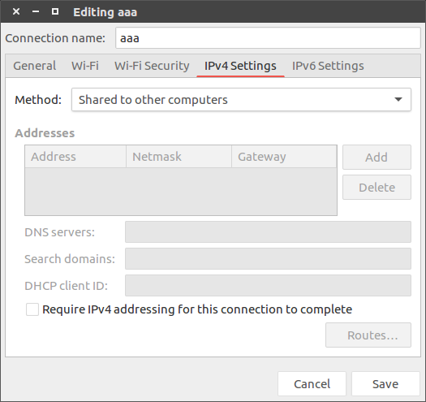

# [Ubuntu 16.04]开放热点

参考：

[Ubuntu 16.04 创建无线热点](https://blog.csdn.net/ac_dao_di/article/details/71908444)

[How to create wifi hotspot in Ubuntu 16.04 since AP-Hotspot is no longer working](https://askubuntu.com/questions/762846/how-to-create-wifi-hotspot-in-ubuntu-16-04-since-ap-hotspot-is-no-longer-working)

利用笔记本开放`wifi`热点，当前系统为`Ubuntu 16.04`

## 是否支持热点

通过工具`iw`实现

    iw list | grep -i ap

    zj@zj-ThinkPad-T470p:/etc/NetworkManager/system-connections$ iw list | grep -i ap
        Device supports AP-side u-APSD.
            * AP
            * AP/VLAN
            Capabilities: 0x11ef
            Capabilities: 0x11ef
            VHT Capabilities (0x039071b0):
            * start_ap
            * set_noack_map
            * AP: 0x00 0x10 0x20 0x30 0x40 0x50 0x60 0x70 0x80 0x90 0xa0 0xb0 0xc0 0xd0 0xe0 0xf0
            * AP/VLAN: 0x00 0x10 0x20 0x30 0x40 0x50 0x60 0x70 0x80 0x90 0xa0 0xb0 0xc0 0xd0 0xe0 0xf0
            * AP: 0x00 0x20 0x40 0xa0 0xb0 0xc0 0xd0
            * AP/VLAN: 0x00 0x20 0x40 0xa0 0xb0 0xc0 0xd0
            * wake up on EAP identity request
            * AP/VLAN
            * #{ managed } <= 1, #{ AP, P2P-client, P2P-GO } <= 1, #{ P2P-device } <= 1,
        HT Capability overrides:
        Driver supports full state transitions for AP/GO clients
        Driver/device bandwidth changes during BSS lifetime (AP/GO mode)

如果存在支持`AP`配置那么就可以开放热点

## 创建热点

点击右上角网络图标，选择`Edit Connections...`

选择`Add->WIFI`

修改`Connection name`

在`Wi-Fi`目录下添加`SSID`(热点名)，`Mode`改为`Hotspot`

在`Wi-Fi Security`目录下的`Security`选择`WPA & WPA2 Personal`，并添加密码(**注意：密码至少要包括英文、数字和符号的其中两种，否则无法保存**)

在`IPv4 Settings`目录下的`Method`选择`Shared to other computers`

保存后关闭设置窗口

## 启动热点

**注意 1：之前在`Win10`环境下可以同时连接`wifi`和开放热点，但是在`Ubuntu`环境下只能在连接有线网络的环境下开放热点**

**注意 2：开放热点会屏蔽掉其他`wifi`，重启网络服务即可**

    sudo service network-manager restart

连接有线网络，点击`Connect to Hidden Wi-Fi network`，选择刚才创建的热点

点击`Connect`即可，在`Connection Information`中可以查看

创建的信息保存在

    /etc/NetworkManager/system-connections

完整信息如下

    [connection]
    id=aaa
    uuid=fcb29483-f14b-410c-ad06-519be984bdf2
    type=wifi
    permissions=
    secondaries=

    [wifi]
    mac-address-blacklist=
    mac-address-randomization=0
    mode=ap
    seen-bssids=
    ssid=aaa

    [wifi-security]
    group=
    key-mgmt=wpa-psk
    pairwise=
    proto=
    psk=zj123456

    [ipv4]
    dns-search=
    method=shared

    [ipv6]
    addr-gen-mode=stable-privacy
    dns-search=
    ip6-privacy=0
    method=ignore

