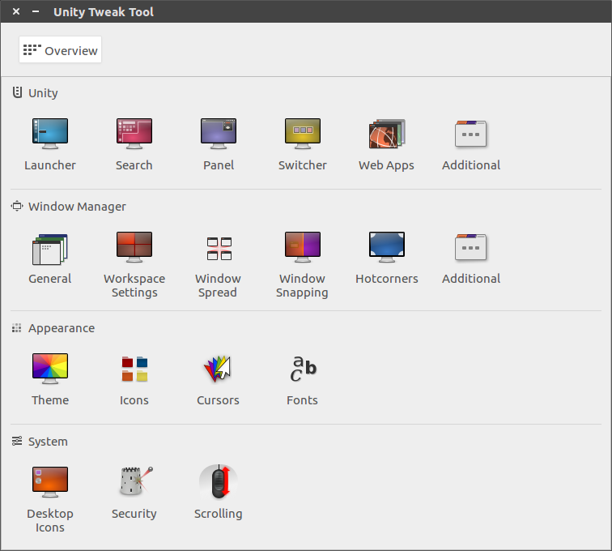
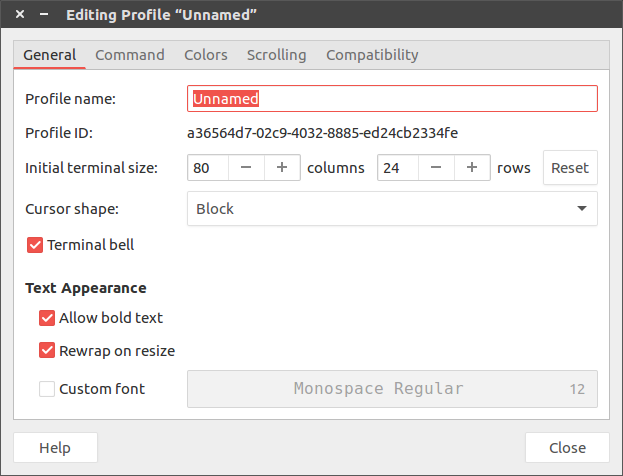

# [Ubuntu 16.04]桌面美化

参考：

[ubuntu16.04修改主题的两种方式](https://jingyan.baidu.com/article/495ba841dac83e38b30ede3b.html)

[Ubuntu 16.04简易美化教程](https://www.cnblogs.com/figowho/p/7895718.html)

[Ubuntu16.04下的主题美化（超级完整！）](https://blog.csdn.net/X_kh_2001/article/details/81126644)

## 安装`unity-tweak-tool`

    sudo apt-get install unity-tweak-tool

`unity-tweak-tool`是一个`unity`桌面的设置管理器，它能够提供便捷的桌面设置

安装完成后可从搜索栏找到或命令行输入`unity-tweak-tool`

*对于`Ubuntu18.04`应该安装`gnome-tweak-tool`*

## 安装主题和图标

### `Flatabulous`主题和`Ultra-flat`图标

    sudo add-apt-repository ppa:noobslab/themes
    sudo apt-get update
    sudo apt-get install flatabulous-theme

    sudo add-apt-repository ppa:noobslab/icons
    sudo apt-get update
    sudo apt-get install ultra-flat-icons

更多主题可取官网下载：[Gnome](https://www.gnome-look.org/browse/)

打开`unity-tweak-tool`

点击`Theme`，选择`Flatabolous`主题

点击`Icons`，选择`Ultra-flat`主题

### Numix daily主题和Numix图标

参考：[Ubuntu下使用Unity Tweak Tool 安装Numix图标主题](https://www.linuxidc.com/Linux/2015-09/123585.htm)

    sudo apt-add-repository ppa:numix/ppa 
    sudo apt-get update 
    sudo apt-get install numix-icon-theme-circle
    sudo apt-get install numix-gtk-theme

## 设置桌面背景

从[wallpaper](https://www.google.com/search?client=ubuntu&channel=fs&biw=1920&bih=896&tbm=isch&sa=1&ei=k6A5XOvDD-ab0gKX6pTIBw&q=wallpaper&oq=wallpaper&gs_l=img.3...0.0..1680055...0.0..0.0.0.......0......gws-wiz-img.fuTHKZduT7g)或者[WallPapers](https://www.gnome-look.org/browse/cat/300/)下载图片

然后点击图片，右键设置为背景即可

## 设置命令行窗口

打开一个命令行窗口，点击`Edit->Preferences`，选择`Profiles->News`，新建一个`Profile`

选择`Colors->Text and Background Color->Use transparent background`，拖动滑动条来设置背景透明度

保存该设置后退出，点击菜单栏`Terminal->Change Profile`，选择新建的`profile`