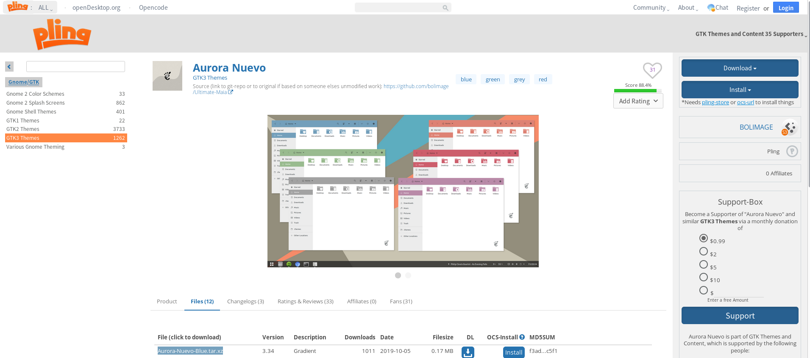
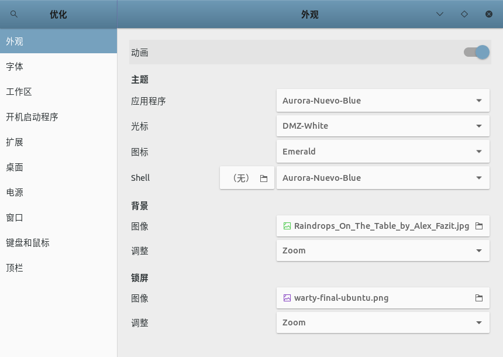
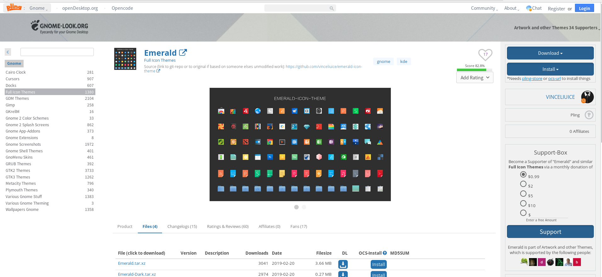
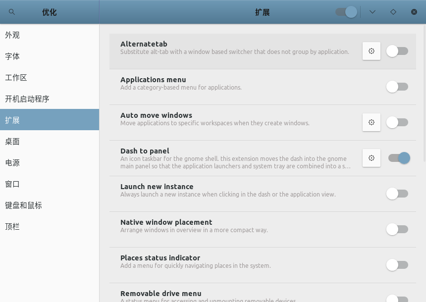
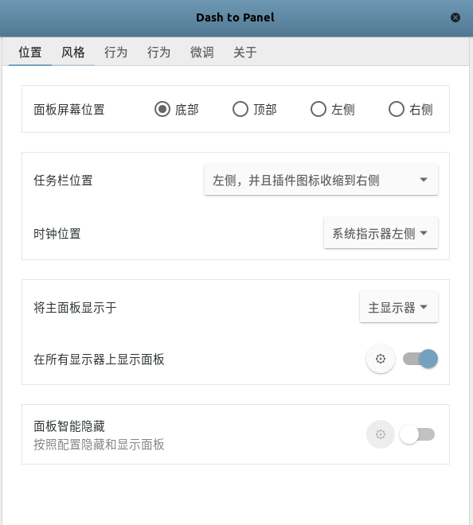

# [Ubuntu 18.04]桌面美化

参考：[ubuntu18.04美化主题（完整版）](https://blog.csdn.net/qq_42527676/article/details/91356154)

从`Ubuntu  16.04`升级到了`Ubuntu 18.04`，`Ubuntu 16.04`默认使用`Unity`作为桌面，而`Ubuntu 18.04`默认使用`Gnome`，所以需要重新开始桌面配置

## 安装

```
$ sudo apt install gnome-tweak-tool gnome-shell-extensions
```

即可从菜单栏中打开优化（`Tweaks`）工具

## 预配置

打开配置工具后如果发现`外观 -> Shell`选项有一个感叹号，需要先去除，否则无法配置这个地方

参考[ubnutu桌面环境Gnome 配置tweak tool时看不到extension插件选项](https://blog.csdn.net/ksws0292756/article/details/79936965)，先注销当前用户，然后在登录界面找到一个齿轮图标，点击后选择`GNOME`主题，即可去除感叹号

## 配置

主要配置三个部分：

1. 主题
2. 图标
3. 任务栏

### 主题

从网站[ping GTK3 Themes](https://www.pling.com/browse/cat/135/order/latest/)中选择自己喜欢的主题，下载安装包，解压后放置在`/usr/share/themes`路径下。当前使用主题[Aurora-Nuevo-Blue](https://www.pling.com/p/1283611/)



打开配置工具，右侧类别中选择`扩展`，打开`User themes`选项；选择右侧类别`外观`，在`应用程序`中选择`Aurora-Nuevo-Blue`，在`Shell`中选择`Aurora-Nuevo-Blue`



### 图标

从网站[ping Full icon Themes](https://www.pling.com/s/Gnome/browse/cat/132/order/latest/)中选择自己喜欢的图标，同样下载安装包，解压后放置在`/usr/share/icons`路径下．当前使用图标[Emerald](https://www.pling.com/s/Gnome/p/1012534)



打开配置工具，选择右侧类别`外观`，在`图标`中选择`Emerald`

### 任务栏

打开配置工具，选择右侧类别`扩展`，打开选项`Dash to panel`，点击配置图标



根据自己需求选择面板位置、任务栏位置、是否显示日期等等

