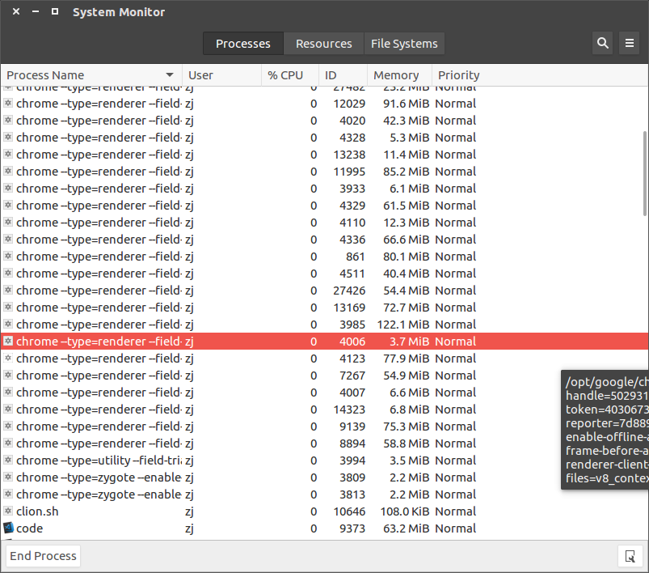

# 查询阻塞进程并杀死

遇到程序阻塞，需要查询到进程`id`再进行`kill`，有两种方式进行查询

## 命令行模式

    $ ps -ef | grep 进程名 

## 图像模式

进入搜索栏，输入`System Monitor`，可以查看相应的进程信息

## 相关阅读

* [解决android Studio 安装完运行提示failed to find build tools revision 24.0.2](https://blog.csdn.net/qq_28637193/article/details/52549622)