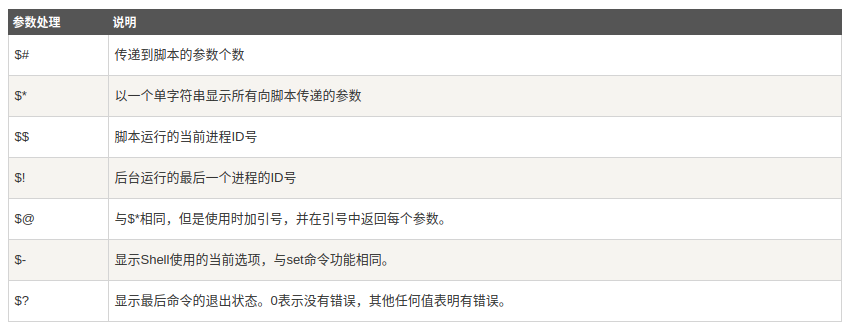

# 函数

## 定义

格式如下：

```
[function] funname()
{
    action;
    [return int;]
}
```

* 关键字`function`可选
* 返回语句可选，如果不加，以最后一条命令运行结果作为返回值

## 示例1

```
$ cat test.sh 
#!/bin/bash

func()
{
    echo "this is func"
}

function compute()
{
    return 3
}

func
compute

echo "compute's result is $?"
```

定义两个函数`func`和`compute`，使用`$?`获取最后命令（即函数`compute`）的退出状态

```
$ bash test.sh 
this is func
compute's result is 3
```

## 参数

对于函数参数的传递和获取，其使用方式和命令行参数一致。通过`$n`获取第`n`个参数值

```
$1
$2
$3
...
${10}
${11}
```

并使用以下特殊符号获取传递到函数的信息



## 示例2

```
$ cat test.sh 
#!/bin/bash

func()
{
    echo "command line parameters: $@"
}

function compute()
{
    NUM=0
    for i in $@
    do
        NUM=`expr ${NUM} + ${i}`
    done
    return ${NUM}
}

func "$@"
compute 2 3 4 5

echo "compute's result is $?"
```

函数`func`打印所有命令行参数；函数`compute`计算输入参数之和并返回结果。结果如下：

```
$ bash test.sh zj zzjj
command line parameters: zj zzjj
compute's result is 14
```

## 相关阅读

* [Shell 函数](https://www.runoob.com/linux/linux-shell-func.html)