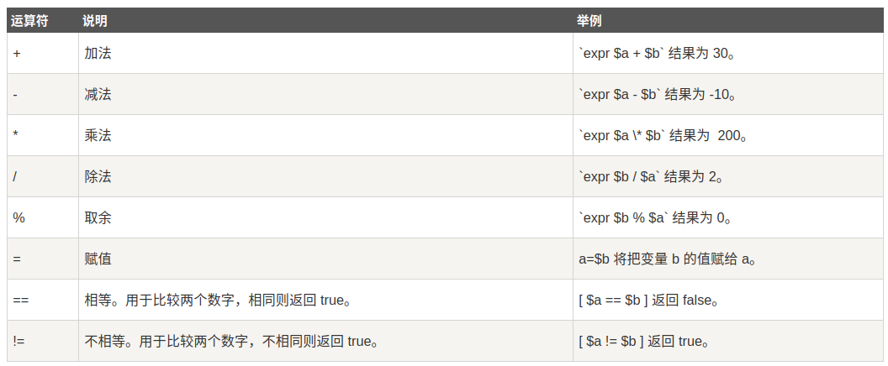
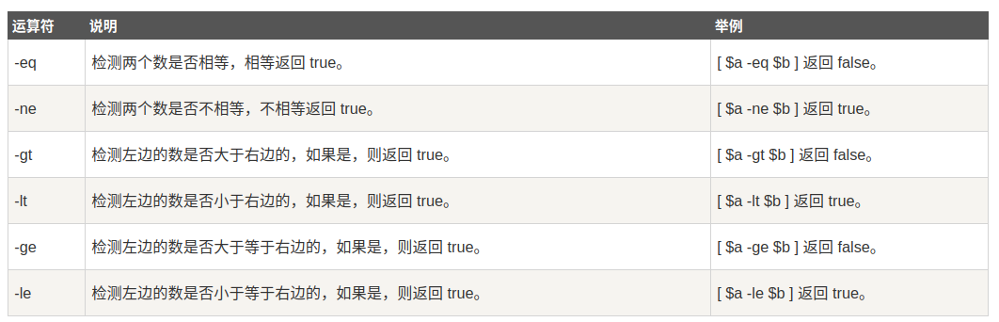
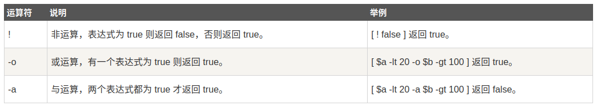
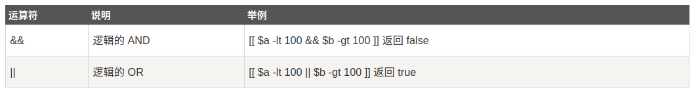
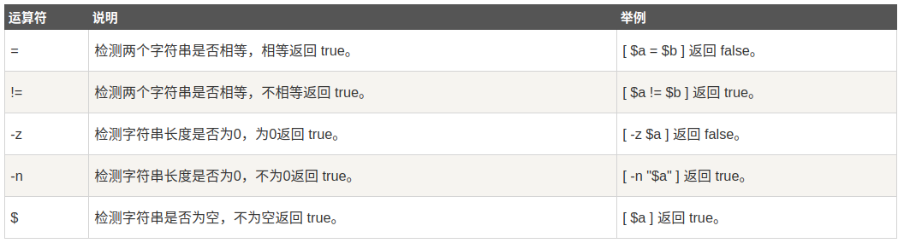
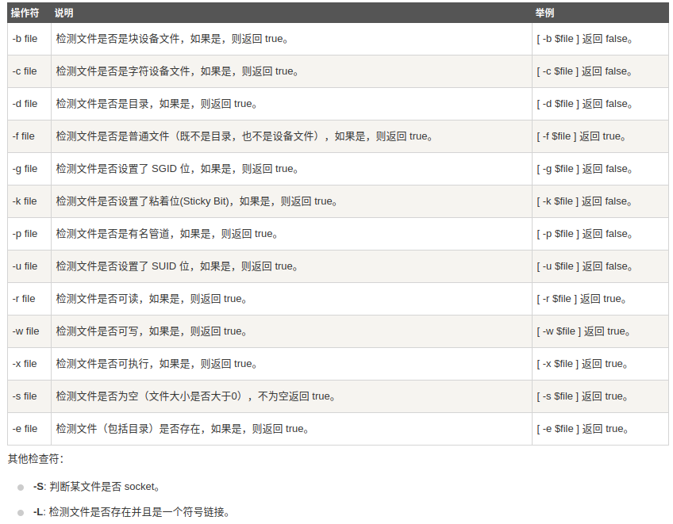

# 基本运算符

`shell`支持以下运算符

* 算术运算符
* 关系运算符
* 布尔运算符
* 字符串运算符
* 文件测试运算符

## expr

`expr`是表达式计算工具，使用它来完成表达式的求职操作

格式如下：

```
$ expr expression
# 示例
$ expr 3 + 4
7
```

**注意：运算符和算子之间必须要有空格**

在`shell`脚本中使用`expr`时需要用反引号将完整表达式括起来

```
VAR=`expr 3 + 4`
```

## 算术运算符



**注意：乘号（`*`）必须加反斜杠`\*`**

示例如下：

```
$ cat test.sh 
#!/bin/bash

VAR1=`expr 3 + 4`
VAR2=`expr 3 == 4`

echo $VAR1
echo $VAR2
```

执行如下：

```
$ bash test.sh 
7
0
```

## 关系运算符



**注意：关系运算符只支持数字，不支持字符串，除非字符串的值是数字**

## 布尔运算符



## 逻辑运算符



## 字符串运算符



## 文件测试运算符

文件测试运算符用于检测`Unix`文件的各种属性



## 相关阅读

* [Shell 基本运算符](https://www.runoob.com/linux/linux-shell-basic-operators.html)
