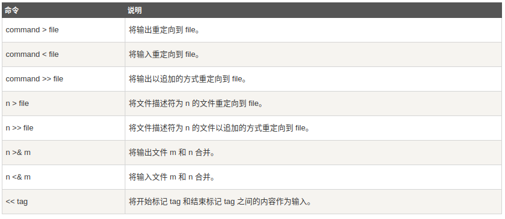

# 输入和输出重定向

## 标准文件

一般情况下，每个`Unix/Linux`命令运行时都会打开三个文件：

* 标准输入文件(`stdin`)：`stdin`的文件描述符为`0`，`Unix`程序默认从`stdin`读取数据
* 标准输出文件(`stdout`)：`stdout`的文件描述符为`1`，`Unix`程序默认向`stdout`输出数据
* 标准错误文件(`stderr`)：`stderr`的文件描述符为`2`，`Unix`程序会向`stderr`流中写入错误信息

默认情况下，`stdin`、`stdout`和`stderr`指向的都是当前终端

## 重定向

可通过以下命令进行重定向



如果需要将标准错误文件重定向到文件，操作如下：

```
command 2 > file
# 追加方式
command 2 >> file
```

如果将`stdout`和`stderr`合并在一起重定向，操作如下：

```
command > file 2>&1
# 追加方式
command >> file 2>&1
```

## /dev/null

`/dev/null`是一个特殊文件，写入该文件的内容将被舍弃，无法从`/dev/null`中读取内容，起到`禁止输出`的作用

```
# 重定向输出到/dev/null
command > /dev/null
# 重定向stdout和stderr
command > /dev/null 2>&1
```

## 相关阅读

* [Shell 输入/输出重定向](https://www.runoob.com/linux/linux-shell-io-redirections.html)