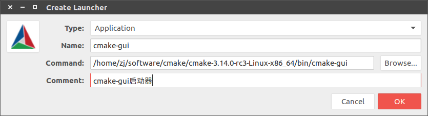

# CMake

从官网下载：[Get the Software](https://cmake.org/download/)。可以下载源码自己编译，或者下载已编译库

## 编译源码

旧的`cmake`没有卸载

    $ cmake .
    $ make
    $ make install

旧的`cmake`已卸载

    $ ./bootstrap
    $ make
    $ make install

## 卸载cmake

    $ sudo apt-get remove --purge cmake
    $ sudo apt-get autoremove

## 安装cmake

将可执行文件的路径加入`~/.bashrc`

    $ vim ~/.bashrc
    ...
    # cmake
    PATH=/home/zj/software/cmake/cmake-3.14.0-rc3-Linux-x86_64/bin:$PATH

刷新环境变量后打印版本

    $ source ~/.bashrc
    $ cmake --version
    cmake version 3.14.0-rc3

    CMake suite maintained and supported by Kitware (kitware.com/cmake).

### cmake-gui启动器设置

在官网的已编译库中已存在`cmake-gui`文件,制作启动器

    $ gnome-desktop-item-edit --create-new ~/Desktop

将`cmake-gui.desktop`放入`~/.local/share/applications`中,即可在搜索栏中检索得到`cmake-gui`

    $ cp Desktop/cmake-gui.desktop ~/.local/share/applications/

## 相关阅读

* [Linux cmake安装，配置以及测试](https://blog.csdn.net/u012005313/article/details/45844655)
* [Installing CMake](https://cmake.org/install/)