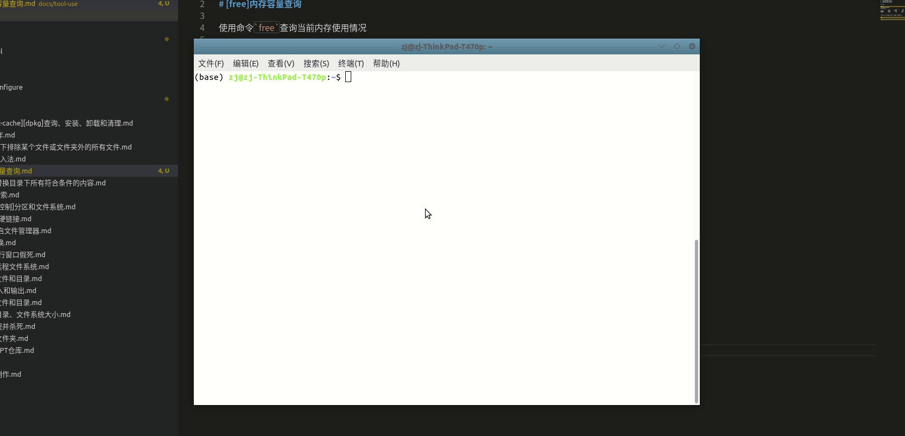

# [free]内存使用查询

可通过查询文件`/proc/meminfo`来得到当前系统内存使用情况

```
$ cat /proc/meminfo 
MemTotal:       65591140 kB
MemFree:          510832 kB
MemAvailable:   51038268 kB
Buffers:         5041216 kB
Cached:         44588952 kB
SwapCached:       265456 kB
Active:         34707380 kB
。。。
。。。
```

不过文件查询得到的按`kB`为单位的内存数据，可以使用命令[free](http://manpages.ubuntu.com/manpages/bionic/man1/free.1.html)显示系统中的可用和已用内存量

## 定义

```
free [选项]
```

常用选项有：

1. -b：以字节显示输出
2. -m：以M字节显示输出
3. -g：以G字节显示输出

## 示例

```
# 中文
# 以M字节显示输出
$ free -m
              总计         已用        空闲      共享    缓冲/缓存    可用
内存：       15782       12023         812         391        2945        3154
交换：        2047          21        2026
# 英文
```
$ free -h
                     total        used        free      shared  buff/cache   available
Mem:            62G         12G        335M        308M         49G         48G
Swap:          7.6G        4.2G        3.5G
```
```

配合`watch`命令，每隔`1s`查询一次并显示

```
$ watch -n 1 free -m
```



## 字段说明

按行说明：

* `Mem`：`CPU`内存使用
* `Swap`：交换区内存使用

按列说明：

* `total`：总内存。等同于`meminfo`中的`MemTotal`和`SwapTotal`
* `used`：使用内存。其计算方式为`total - free - buffers - cache`
* `free`：未使用内存。等同于`meminfo`中的`MemFree`和`SwapFree`
* `shared`：`tmpfs`使用的内存(大部分)。等同于`meminfo`中的`Shmem`
* `buffers`：内核缓冲区使用的内存。等同于`meminfo`中的`Buffers`
* `cache`：页缓存和`slabs`使用的内存。等同于`Cached`和`SReclaimable`
* `buff/cache`：`buffers`和`cache`之和
* `available`：新应用可使用内存的估计，估计了未使用和缓存内存，不过有些缓存不一定能够释放

## cache和buffer的区别

>buffer是即将要被写入磁盘的，而cache是被从磁盘中读出来的

## buff/cache内存占用过高

参考：

* [Linux中buff/cache内存占用过高解决办法](https://www.cnblogs.com/cpw6/p/11711817.html)
* [ubuntu下buff/cache占用过大处理](https://blog.csdn.net/hechaojie_com/article/details/82782880)

## 相关阅读

* [【linux】free命令中cached和buffers的区别](https://www.cnblogs.com/chenpingzhao/p/5161844.html)

* [Linux free 命令中 buffers 和 cached 有什么区别？](https://www.zhihu.com/question/51283353)
