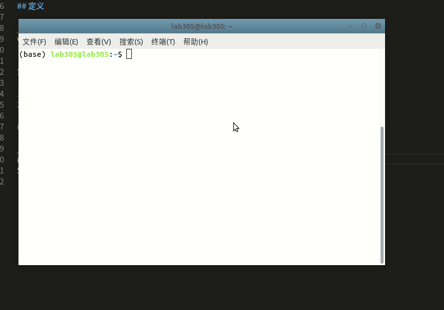
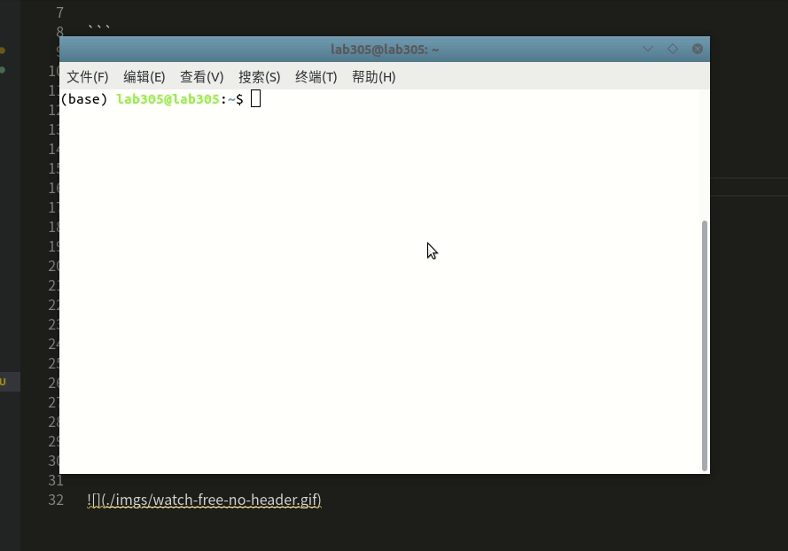

# [watch]命令监测

`watch`命令能够周期性的执行某一个命令，并将执行结果输出到窗口

## 定义

```
watch [options] command
```

常用选项有：

1. `-n`：间隔多少秒执行
2. `-t`：关闭头文本
3. `-d`：高亮显示变化的地方

## 示例

```
# 间隔2秒打印一次内存变化
$ watch -n 2 free -m
```



```
# 间隔2秒打印一次内存变化，同时关闭头文本
$ watch -t -n 2 free -m
```


```
# 高亮显示变化
$ watch -d -n 2 free -m
```



## 相关阅读

* [linux命令大全：watch](http://www.cainiaoxueyuan.com/yunwei/9502.html?wpzmaction=add&postid=9502)